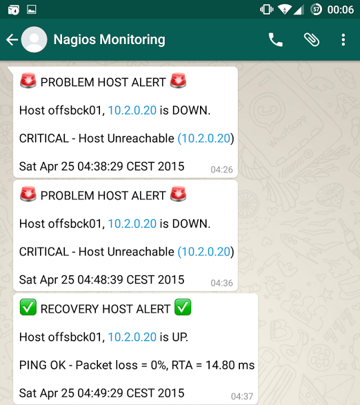

# py-nagios-wa

`py-nagios-wa` is a small Python script that enables sysadmins to receive Nagios notifications on WhatsApp. Teams can
also configure it to send notifications to group chats.

### Dependencies

* Python 2.7
* Yowsup 2.2

A virtualenv is recommended. Dependencies can easily be installed through `pip`. For rapid installation, the setup
script can also be used.

### Installation

Simple set up a new virtualenv and install the requirements.txt through `pip`. Alternatively, for easy installation,
you can simply execute the setup script. This will set up a new virtualenv for you, and install all dependencies by
running pip in that new virtualenv.

```sh
$ chmod +x ./setup_env.sh
$ ./setup_env.sh
```

### Usage

**Configuring py-nagios-wa**

You will first need to create your `local_settings.py`. Have a look at `example_settings.py` and configure your loca
settings accordingly. For easy installation, you can also copy the example configuration into the local settings file.
You'll then only have to change your login credentials and the `DEFAULT_RECIPIENTS`.

* `CREDENTIALS` - Your Whatsapp username and base64 password.
* `DEFAULT_RECIPIENTS` - Notifications will be sent to these jids.
* `HOST_NOTIFICATION` - Your host notification template.
* `SERVICE_NOTIFICATION` - Your service notification template.

To test out whether your configuration is working, you can simply execute the notify script. This will send a default
notification to the default recipients configured in your `local_settings.py`.

A succesful configuration will yield something like this:

```sh
$ source env/bin/activate
$ cd src/
$ python notify.py
Succesfully connected to the WhatsApp service.
Sending to 31123456789@s.whatsapp.net
Sending to 31123456789-123456789@g.us
All messages have been sent. Disconnecting now!
```

**Configuring Nagios**

Configuring Nagios should at this point not be too difficult. Edit your `commands.cfg` and add the following entries:

```
define command {
    command_name    host-wa
    command_line    /path-to/py-nagios-wa/env/bin/python /path-to/py-nagios-wa/src/notify.py host
}

define command {
    command_name    service-wa
    command_line    /path-to/py-nagios-wa/env/bin/python /path-to/py-nagios-wa/src/notify.py service
}
```

Don't forget to command line paths, of course :-) That's it - you're all set to use WhatsApp for your Nagios
notifications now!

### Screenshot


### License

MIT
